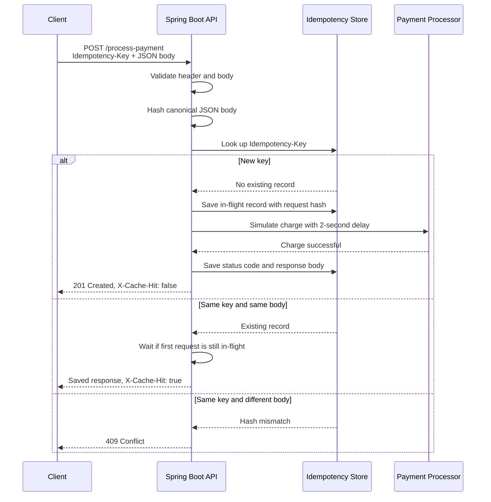

# She Can Code Idempotency Gateway

Spring Boot REST API for IgirePay Technologies that prevents duplicate payment processing when clients retry the same payment request.

## Architecture Diagram



## Setup Instructions

Requirements:

- Java 17
- Maven 3.9+

Run the API:

```powershell
mvn spring-boot:run
```

Keep that PowerShell window open. The server starts on `http://localhost:8080`.

In a second PowerShell window, run the helper script:

```powershell
.\test-payment.ps1
```

Run tests:

```powershell
mvn test
```

## API Documentation

### Process Payment

`POST /process-payment`

Required header:

```text
Idempotency-Key: <unique-payment-key>
```

Request body:

```json
{
  "amount": 100,
  "currency": "FRW"
}
```

Successful first response:

```http
HTTP/1.1 201 Created
X-Cache-Hit: false
Content-Type: application/json
```

```json
{
  "message": "Charged 100 FRW"
}
```

Duplicate response with the same key and same body:

```http
HTTP/1.1 201 Created
X-Cache-Hit: true
Content-Type: application/json
```

```json
{
  "message": "Charged 100 FRW"
}
```

Same key with a different body:

```http
HTTP/1.1 409 Conflict
Content-Type: application/json
```

```json
{
  "timestamp": "2026-05-20T10:00:00Z",
  "status": 409,
  "error": "Conflict",
  "messages": [
    "Idempotency key already used for a different request body."
  ]
}
```

Example PowerShell commands:

```powershell
$key = [guid]::NewGuid().ToString()
$body = '{"amount":100,"currency":"FRW"}'

Invoke-WebRequest `
  -UseBasicParsing `
  -Uri "http://localhost:8080/process-payment" `
  -Method POST `
  -Headers @{ "Idempotency-Key" = $key } `
  -ContentType "application/json" `
  -Body $body

Invoke-WebRequest `
  -UseBasicParsing `
  -Uri "http://localhost:8080/process-payment" `
  -Method POST `
  -Headers @{ "Idempotency-Key" = $key } `
  -ContentType "application/json" `
  -Body $body
```

Expected result:

- First request: `201 Created` with `X-Cache-Hit: false`
- Second request with the same `$key` and `$body`: `201 Created` with `X-Cache-Hit: true`

Important: do not generate a new `$key` before the second request. A new key means a new payment, so `X-Cache-Hit: false` is correct.

Example curl commands:

```bash
curl -i -X POST http://localhost:8080/process-payment \
  -H "Content-Type: application/json" \
  -H "Idempotency-Key: order-123" \
  -d '{"amount":100,"currency":"FRW"}'

curl -i -X POST http://localhost:8080/process-payment \
  -H "Content-Type: application/json" \
  -H "Idempotency-Key: order-123" \
  -d '{"amount":100,"currency":"FRW"}'
```

## Troubleshooting

If PowerShell shows `Unable to connect to the remote server`, the API is not running. Start it first:

```powershell
mvn spring-boot:run
```

Keep that window open, then send requests from another PowerShell window.

If Windows PowerShell shows `Object reference not set to an instance of an object`, use `-UseBasicParsing` with `Invoke-WebRequest`, as shown in the examples above.

## Design Decisions

- The API stores idempotency records in an in-memory `ConcurrentHashMap`, which keeps the assessment simple and easy to run locally.
- Each request body is converted to canonical JSON and hashed with SHA-256. This lets the API detect whether a repeated key belongs to the same payment request.
- The first request stores a `CompletableFuture` before the simulated payment starts. If an identical retry arrives while the first request is still processing, it waits for that future and returns the same result instead of starting a second charge.
- Successful first payments return `201 Created`. Replayed responses return the exact same status and body with `X-Cache-Hit: true`.
- Validation rejects missing idempotency keys, non-positive amounts, and invalid currency codes before processing.

## Developer's Choice Feature

I added automatic idempotency-key retention cleanup. Real fintech systems should not keep idempotency keys forever because memory and storage will grow without limit. This app keeps completed idempotency records for `24h` by default and runs an hourly cleanup job.

The retention window is configurable:

```properties
app.idempotency.retention=24h
```

## Project Structure

```text
src/main/java/com/igirepay/idempotencygateway
  config/       Application properties
  payment/      Controller, service, DTOs, exceptions
src/test/java/com/igirepay/idempotencygateway
  payment/      MockMvc acceptance tests
```
